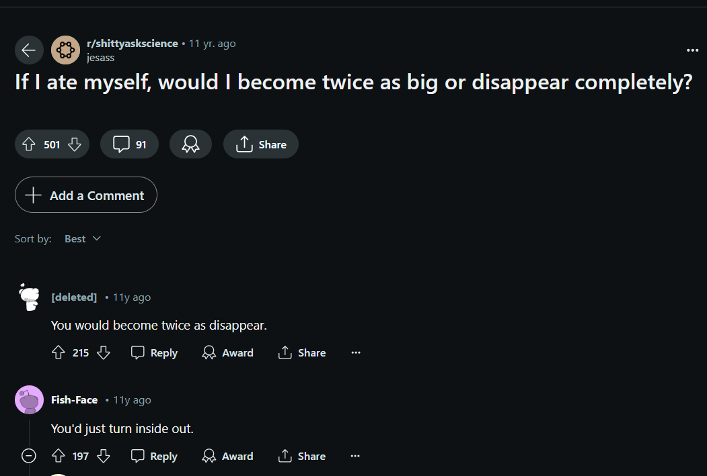
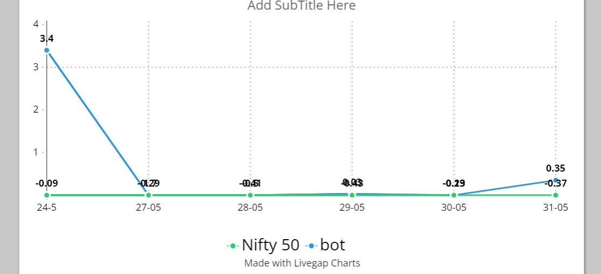
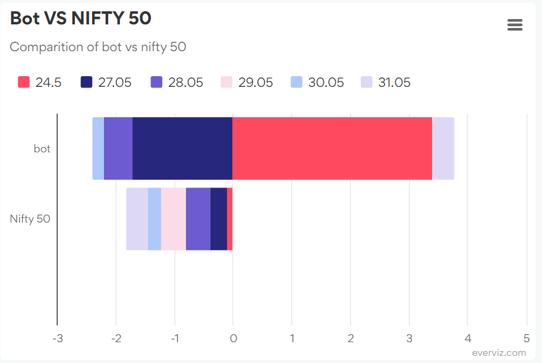
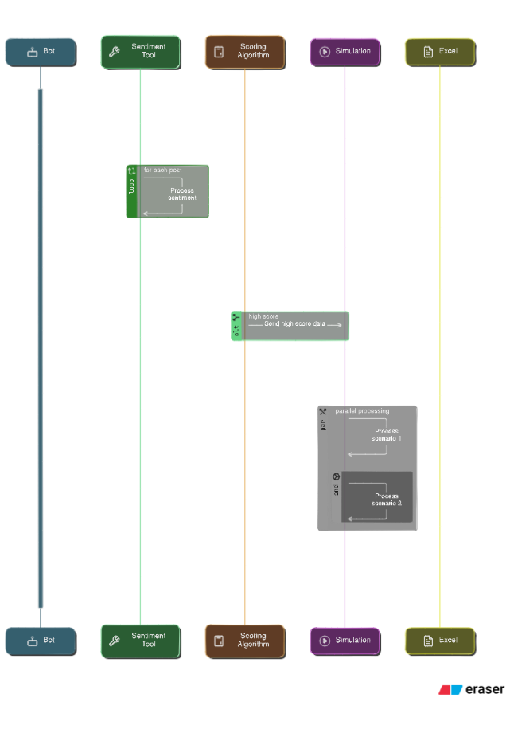

**Prologue:**

It's 3:00 AM, time to wake up and grind. The stock market opens in six hours. First thing I do is grab my laptop and check my Business Insider emails. Who needs sleep when millions are at stake?

Next, I go for a "light" 50-mile run. Just enough to get my adrenaline pumping and blood flowing, a perfect start to the day.

I come back home, and it's time for breakfast. Eating raw again—wish I had time to cook, but I’m far too busy for that. Bon appétit.

It's been six months since I left my job and my family. Engineering was good, but the real money is in the stock market. Who needs people to talk to when your ambitions are in billions?

It's 9am, and now it's time to work. The stock market doors open. I sit in front of my six-screened PC, powered by the latest NVIDIA drivers. With NSE graphs and crypto charts open, I start another day of trading. Stocks, options, futures, derivatives, edges, funds— we handle it all in minutes. I make phone calls, execute orders—another successful day of trading, simple as that.

Market closes, and I spend the rest of the day counting my rupees.

Listen, I dont know anything about stokes I lost all my money on trading and on last pennies. Wish there was something that could tell me what stocks to buy…..

**Stock Recommender Algorithm?? System Design??**

I am an engineer and pretty okay at coding. I should be able to easily create an algorithm that will help me make the right investment choices. You might ask, “But Varun, you do not know anything about stocks or trading. How will you write the algorithm?”

As the saying goes, “When in doubt, Reddit it out.” What is Reddit, you ask?

Well, it is a place for intellectual people like me to have intellectual conversations and discuss topics that matter to the world, such as the ones below.

On Reddit, we also conduct cutting-edge research like the following revolutionary papers:

1. If I shave my golden retriever, will it turn into a Labrador?
2. If money is the root of all evil, what’s the square root of evil?
3. Do fish get thirsty?
4. If I hold my breath too long, will I float?
5. Why does the sun only appear during the day and not at night when I need it the most?

I know these guys from Reddit are f’ing geniuses. If I can somehow build a bot that scrapes through Reddit, identifies all conversations about stocks, and invests based on those discussions, I will be a billionaire. There is literally zero downside; the stocks will only go up.

So here is the plan: it’s the weekend. Sure, I could spend time with my family, friends, dog, or go out and touch some grass. Or, instead, I can build this algorithm which will make me millions. I know, I’m wasting my life away and I’m an idiot, but do you have an algorithm that trades stocks? I didn’t think so.

Here is how it goes,

I will build a bot that will scrape through Reddit every day, bringing in all the data while I have my daily cup of coffee, gazing over my balcony as the sunshine blazes through my face. Then, I will use machine learning to identify stocks and perform sentiment analysis. I will use my logical and problem-solving capabilities, which I have plenty of, to build a top-notch algorithm that will score, recommend, and shortlist stocks. Then, I will build an app to test how good my algorithm is by investing fake money and generating daily reports. Sounds simple, right? Yeah, it is simple for a guy like me.

With the plan laid out, I sat in my chair and began to code. I breezed through building a bot that extracts data. Now, to analyze the data, I can use “MACHINE LEARNING”, build a model, and train it to identify sentiment. But there is a problem: people on Reddit don't talk like how normal people talk. Their level of intelligence is unearthly. So, I had to prepare my own database, which means manually labeling 1 million rows of data as positive and negative. For example:

1. “Your blog is bad” - labeled as negative.
2. “I have an idea to help you make your blog better” - labeled as super negative as your idea probably sucks.

I could have spent 10 hours labeling this data, or I could just use GEMINI, a language model so smart it can even understand Reddit, and the best thing is it's free. So, I used GEMINI to analyze my data.

Remember when I said GEMINI is smart? I lied. Choosing GEMINI might have been the dumbest choice. It is unable to comprehend how a JSON looks like. How can you be so dumb when you are literally fed the entire internet of knowledge? I had to waste hours building a text extractor and JSON builder to solve it.

Next, build an algorithm to take this analyzed data and create an algorithm that will score the stocks based on the analysis. If you have any thinking capability, you will probably say, “Varun, why don't you just ask GEMINI to score and shortlist?” And you're probably right. I could have saved hours doing so. But instead, I spent hours coding a custom algorithm that is barely functioning and probably 10x worse than what GEMINI could have done. But hey, I am a programmer, and that's how we do it. We take minute tasks and solve them in hours. Also, it works, and that's all that matters.

Boom, done right! Wrong. I want people to trust my algorithm, I want it SEBI certified, so I would need proof and data to prove its validity. So, I spent another 4 hours building a simulation that uses the algorithm to invest in the top 5 rated stocks. Here's how it works: I give it 1 lakh rupees every morning, it divides the money into five and invests, generating the results in the evening. Here are a few of the stocks it chose, for example:

- Day 1: PFC, NCC, Dixon, HAL, InoxWind
- Day 2: Jio fin, CDSL, LTTS, Coal India, Hindustan Zinc
- Day 3: HAL, HDFC, Power Finance Corporation (PFC), CDSL, LTTS
- Day 4: Power Grid, Adani Power, Adani Green, Adani Ports, CDSL
- Day 5: Asian Paints, Infosys, Apar
- Day 6: Tata Motors, Eicher Motors, IRFC

I know, on a few days it's not five stocks because the algorithm was not able to scrape the real-time money for those stocks, so it ignored them.

So here are the results of NIFTY 50, handled and backed by top financial officials, SEBI-certified advisories, MBA graduates, versus a bot (from the days 24-05 to 31-05):

If you're bad with charts and math, let me break it down. If you invest 1 lakh in my bot, after 6 days you would have 1,01,197.86, and in NIFTY 50, you would have 98,204.22. I mean, what more proof do you need?

So, all that's left for me to do is unplug the simulation and plug in my bank account with SEBI API, and I would have infinite money. Also, if anyone needs financial advice, please don't contact me. I am too busy opening my hedge fund and writing my autobiography.

System Design If your Interested:

